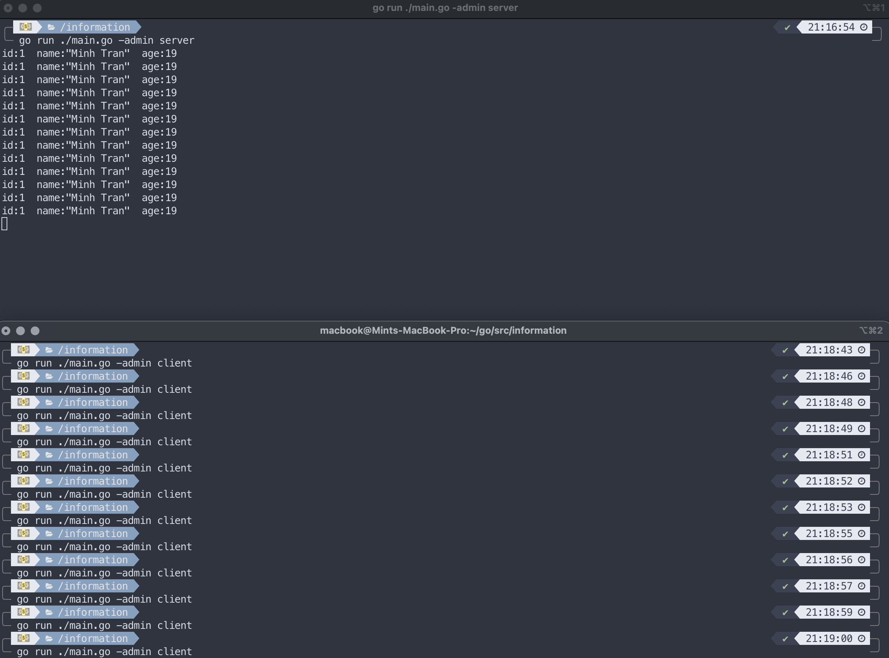

# Instruction for Generating Go Protocol Buffers

The module ([`github.com/golang/Protocol Buffers`](https://pkg.go.dev/mod/github.com/golang/Protocol Buffers))
contains Go bindings for protocol buffers.

The documentation and tutorials by Google can be found at [`Protocol Buffers Go tutorials`](https://developers.google.com/protocol-buffers/docs/gotutorial)

## Package index

Summary of the packages provided by this module:

-   [`proto`](https://pkg.go.dev/github.com/golang/Protocol Buffers/proto): Package
    `proto` provides functions operating on Protocol Buffers messages such as cloning,
    merging, and checking equality, as well as binary serialization and text
    serialization.

-   [`protoc-gen-go/plugin`](https://pkg.go.dev/github.com/golang/Protocol Buffers/protoc-gen-go/plugin):
    Package `plugin` is the generated package for
    `google/Protocol Buffers/compiler/plugin.proto`.
-   [`protoc-gen-go`](https://pkg.go.dev/github.com/golang/Protocol Buffers/protoc-gen-go):
    The `protoc-gen-go` binary is a protoc plugin to generate a Go protocol
    buffer package.

## How do we use Protocol Buffers?

-   Protocol Buffers is faster than JSON and has 3 main components that we have to deal with:

*   Message Descriptors

    -   When using Protocol Buffers we have to define our own messages structure in `.proto` files.

*   Message Implementations

    -   Messages definitions are not enough to represent and exchange data in any programming language. We have to generate classes/objects to deal with data in the chosen programming language.
    -   To install the compiler, download packages:
        -   `go get -u google.golang.org/Protocol Buffers`
        -   `go get -u google.golang.org/Protocol Buffers/proto`
    -   To install the Go protocol buffers plugin:
        -   `go install google.golang.org/Protocol Buffers/cmd/protoc-gen-go@latest`
    -   To compile:
        -   `protoc --go_out=. ./protocol/*.proto`

*   Parsing and Serialization

    -   After defining and creating Protocol Buffers messages, we need to be able to exchange these messages.

## Example Client-Server TCP connection

### Package index

-   [`flag`](https://pkg.go.dev/flag flag): Package
    `flag` implements command-line flag parsing: `admin -client` and `admin -server`

-   [`ioutil`](https://pkg.go.dev/io/ioutil io/ioutil):
    Package `ioutil` implements some I/O utility functions.

-   [`net`](https://pkg.go.dev/net net):
    Package `net` provides a portable interface for network I/O, including TCP/IP, UDP, domain name resolution, and Unix domain sockets. Although the package provides access to low-level networking primitives, most clients will need only the basic interface provided by the Dial, Listen, and Accept functions and the associated Conn and Listener interfaces. The crypto/tls package uses the same interfaces and similar Dial and Listen functions.

### Explanation

-   Send protocol message CML: `go run ./main.go admin -client`
-   Listen to protocol message CML: `go run ./main.go admin -server`
-   Server listens on `tcp`, `127.0.0.1:8085`
-   `sendData()` uses `net.Dial("tcp", "127.0.0.1:8085")` to create a TCP connection between the server and the client. Function receives `data []byte` parameter and writes it to the connection it created before
-   `runClient()` creates a protocol object and uses `proto.Marshal(&object)` to marshal the protocol object before sending it to the connection by calling `sendData()`.
-   `runServer` uses `net.Listen("tcp", "127.0.0.1:8085")` to listen on TCP. Function waits for reading data from the connection by using `ioutil.ReadAll(connection)` and then unmarshal the data received by `proto.Unmarshal(data, object)`
-   Demo
    
